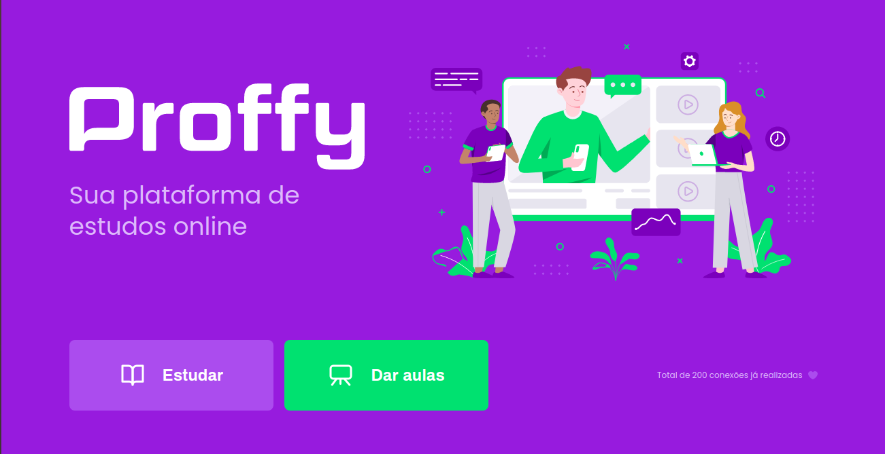

<h1 align="center">
    
</h1>
<h2 align="center">  
  <a href="#%EF%B8%8F-about">About</a> |
  <a href="#-technologies">Technologies</a> | 
  <a href="#-download">Download</a> | 
</h2>
<h1 align="center">
  
</h1>


<h1 align= "center">
   
</h1>

## ⁉️ About
Proffy is a website with **responsive design** that provides a connection between teachers and students. It's possible register a class and filter to see the available classes.

## 🚀 Technologies
- JavaScript
- HTML5
- CSS3
- [NodeJS](https://nodejs.org/en/)
- [Express](https://expressjs.com/pt-br/)
- [Nunjucks](https://mozilla.github.io/nunjucks/)
- [SQLite](https://www.sqlite.org/index.html)

# 📥 Download
```bash
$ git clone https://github.com/luucas-melo/NextLevelWeek.git

$ cd NextLevelWeek

$ npm install

$ npm run dev

$ access https://localhost:5500
```


